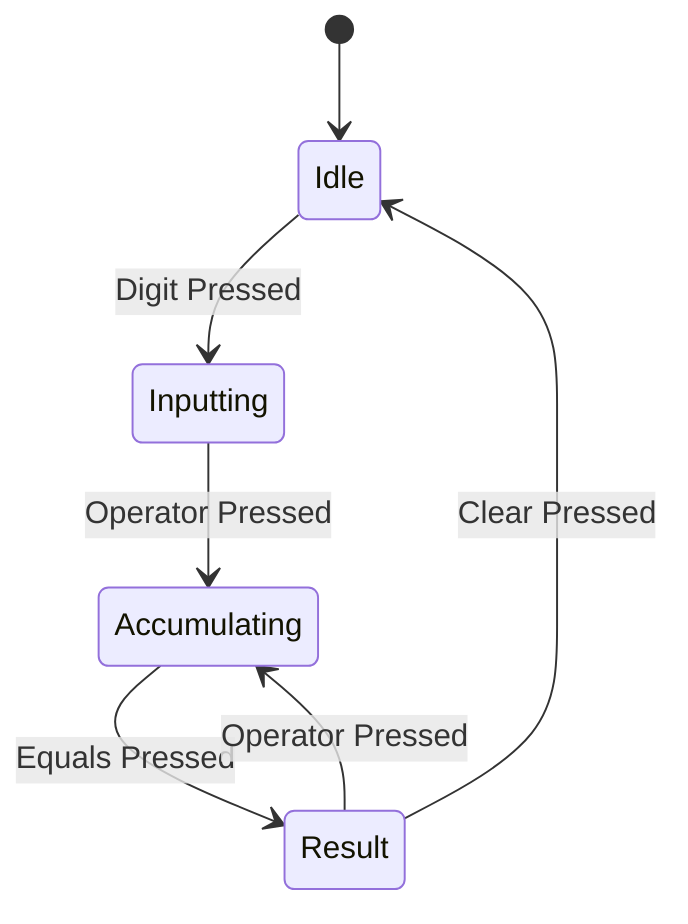

# Data Model: Extensible Calculator

## Entities

### `CalculatorState`
Represents the current memory and display status of the calculator.
- `double displayValue`: The current value shown.
- `double? accumulator`: The value stored from a previous operation.
- `Operation? pendingOperation`: The operation waiting for an operand.
- `bool isNewNumber`: Flag to indicate if the next digit should clear the display or append.

### `Operation` (Abstract)
The base contract for all mathematical actions.
- `String symbol`: e.g., "+".
- `String name`: e.g., "Addition".
- `int priority`: (Optional) To handle operator precedence.
- `int argCount`: 0 or 1.

## State Transitions

## Relationships
- `CalculatorEngine` owns a `CalculatorState`.
- `CalculatorEngine` uses the `OperationsRegistry` to find the correct `Operation`.
